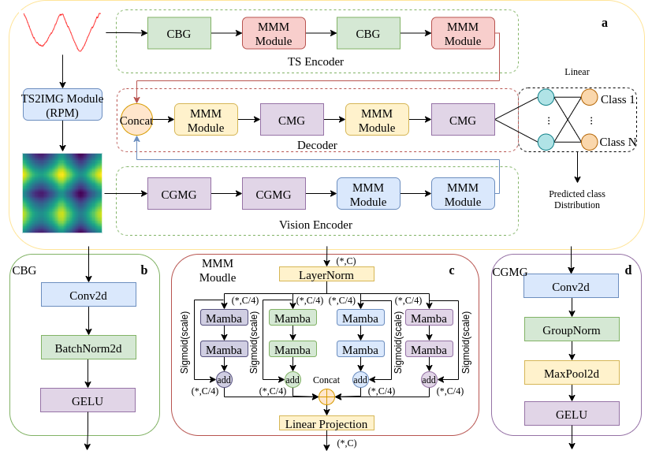
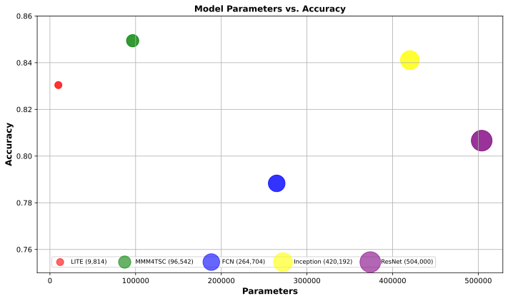
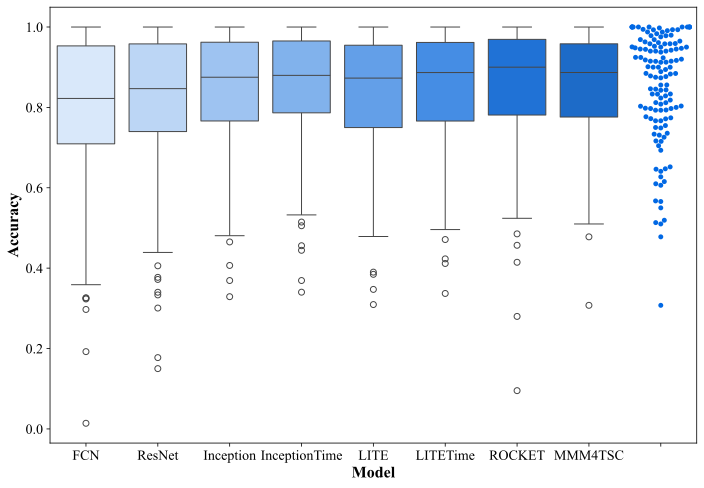
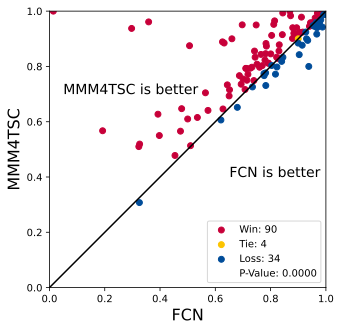
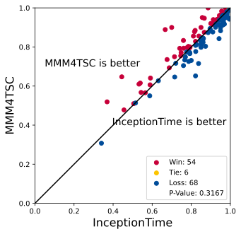
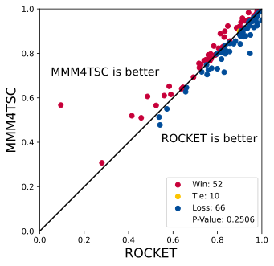
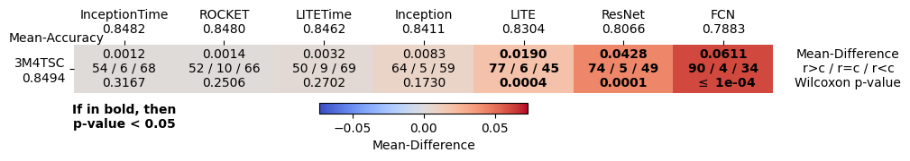
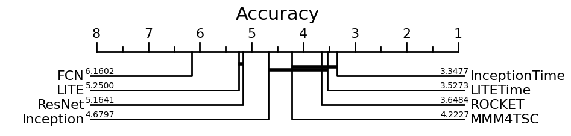

# MMM4TSC: Multimodal Mamba-based Time Series Classification with Fusion of Spatial Location Features
A multimodal time series classification model, MMM4TSC, is presented. By integrating multi-scale multimodal features, the model enhances classification performance and adaptability. Experimental results on all 128 time series datasets from UCR show that MMM4TSC achieves an average accuracy of 84.94\%. Compared to representative methods such as LITETime, InceptionTime, and ROCKET, it exhibits improved average accuracy ranging from 0.12\% to 6.11\%, highlighting its superior adaptability.
## MMM4TSC architecture


## Data
The data used in this project comes from the [UCR/UEA archive](http://timeseriesclassification.com/TSC.zip). 
We used the 128 datasets listed [here](https://www.cs.ucr.edu/%7Eeamonn/time_series_data_2018/).
## Usage of the code
```python
--model: to choose the models from [Encoder, CNN, MMM4TSC](default=MMM4TSC)
--data_path: root path of the data file
--sub_data : to choose the dataset from the UCR Archive (default=Coffee)
```
## Results
Results can be found in the results.csv file for FCN, ResNet, Inception, InceptionTime, ROCKET, LITE, LITETime and MMM4TSC. For non-ensemble methods, results are averaged over five runs, for ensemble methods, we ensemble the five runs.
### Average performance and Params comparison
The following figure shows the comparison between MMM4TSC and state of the art complex deep learners. The comparison consists on the average performance and the number FLOPS.

### MMM4TSC VS other Models Performance 
The following figure shows the comparison between MMM4TSC and state of the art complex deep learners. 

* Box (Box): The box part of the boxplot contains the middle 50% of the data. The bottom and top of the box are the first quartile (Q1) and the third quartile (Q3), respectively, indicating that 25% of the data lies below the box and another 25% lies above the box.

* Median (Median): The horizontal line inside the box represents the median (Q2) of the data, which is the middle value of the dataset, dividing it into two equal parts.

* Whiskers (Whiskers): The two lines outside the box are called whiskers, which can extend to the minimum and maximum values of the dataset, but usually do not exceed 1.5 times the interquartile range (IQR, i.e., Q3 - Q1). Data points that fall outside this range are often considered outliers.

* Outliers (Outliers): Points that lie beyond the whiskers are considered outliers or extreme values, significantly deviating from the central area of the data.

* Data Points (Data Points): In addition to the box and whiskers on the boxplot, individual data points can also be displayed, which helps to observe the specific data distribution.

When comparing the performance of different models, the boxplot can provide the following information:

* Performance Distribution: The length of the box indicates the interquartile range of the model's accuracy rate. The shorter the box, the smaller the fluctuation in model performance, indicating more stable performance.

* Median Performance: The horizontal line inside the box represents the median accuracy rate, which can serve as a robust indicator of model performance.

* Performance Range: The length of the whiskers indicates the maximum and minimum values of model performance, helping us understand the range of model performance.

* Outliers: If there are outliers, it may indicate that the model's performance is exceptionally good or exceptionally poor in certain specific situations.
### MMM4TSC 1v1 with FCN, InceptionTime and ROCKET
The following compares MMM4TSC with FCN, InceptionTime and ROCKET using the accuracy performance on the test set of the 128 datasts of the UCR archive.

|  |  ||
| --- | --- | --- |

### MMM4TSC MCM with SOTA
The following 1v1 and multi-comparison matrix shows the performance of MMM4TSC with respect to the SOTA models for Time Series Classification.
The following compares MMM4TSC with FCN, ResNet and Inception using the accuracy performance on the test set of the 128 datasts of the UCR archive.


### CD Diagram
The following Critical Difference Diagram (CDD) shows the comparison following the average rank between classifiers.


## Requirements
```python
python=3.8
cuda=12.1
pytorch>=2.1.1
mamba_ssm
matplotlib
numpy
pandas
```
## Acknowledge

## Citation
